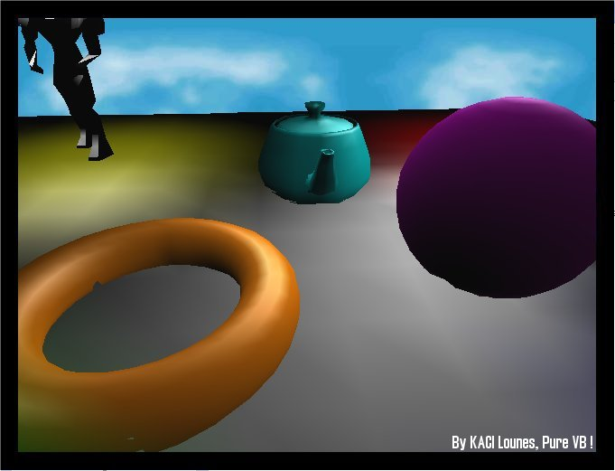



## GouraudShading 3D, Pure VB, KACI Lounes

### Description

An exellent 3D engine in pure vb, no references, include lights, fog, clipping, and other pretty stuffs.
 
### More Info
 

             |
---                |---
**Submitted On**   |2005-03-12 15:50:14
**By**             |[KACI   Lounes](https://github.com/Planet-Source-Code/PSCIndex/blob/master/ByAuthor/kaci-lounes.md)
**Level**          |Advanced
**User Rating**    |5.0 (90 globes from 18 users)
**Compatibility**  |VB 6\.0
**Category**       |[Graphics](https://github.com/Planet-Source-Code/PSCIndex/blob/master/ByCategory/graphics__1-46.md)
**World**          |[Visual Basic](https://github.com/Planet-Source-Code/PSCIndex/blob/master/ByWorld/visual-basic.md)
**Archive File**   |[GouraudSha199794612006\.zip](https://github.com/Planet-Source-Code/kaci-lounes-gouraudshading-3d-pure-vb-kaci-lounes__1-65535/archive/master.zip)

